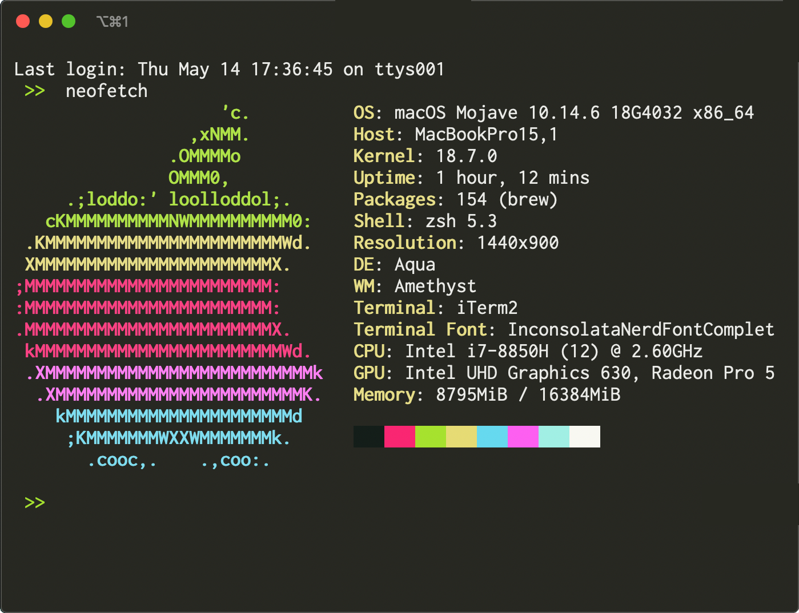

# MonokaiFree for iTerm2

A port of the [MonokaiFree](https://github.com/gerardroche/sublime-monokai-free) theme by @gerardroche for iTerm2.

## How to install

1. Launch iTerm2.
2. Go to `Preferences`.
3. Choose `Profiles`.
4. Go to  `Colors` tab.
5. Click on `Color Presets`.
6. Choose `Import...`.
7. Select `MonokaiFree.itermcolors`.
8. Click on `Color Presets` again and choose `MonokaiFree`.

## License

[MIT](LICENSE)

## Acknowledgements

Thanks to @gerardroche as the original creator of [MonokaiFree](https://github.com/gerardroche/sublime-monokai-free)
